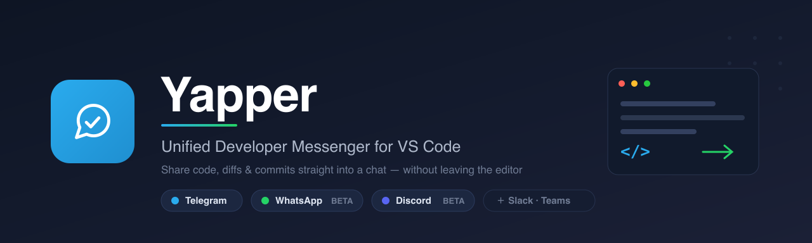
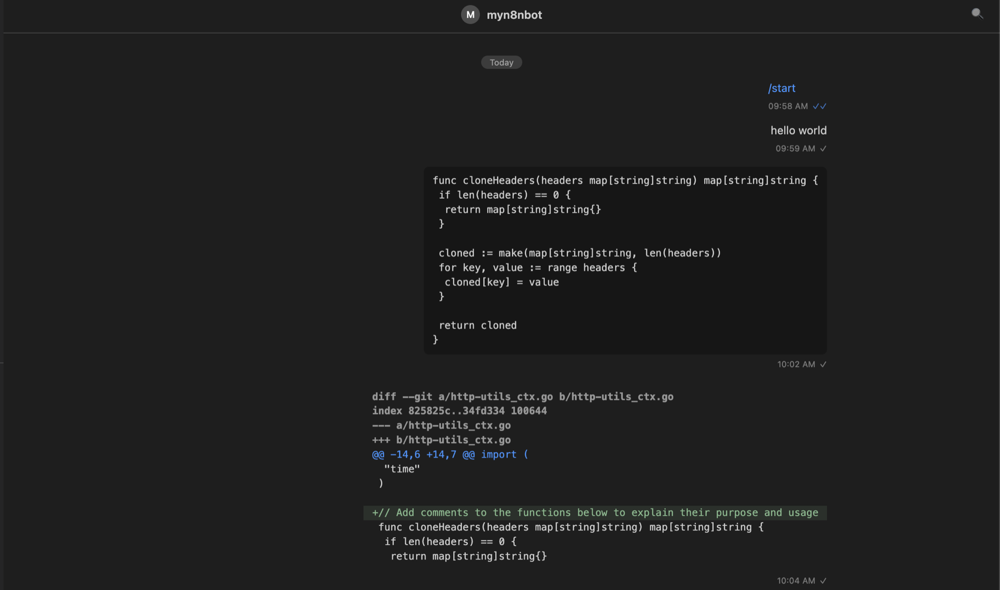
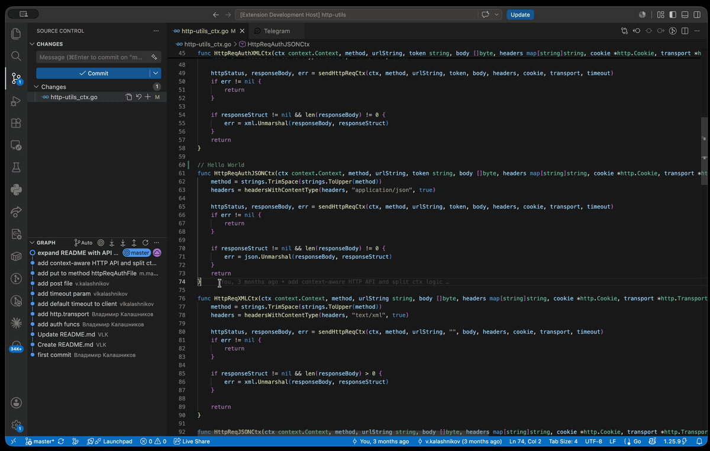

  

  <b>Bring your work chats into VS&nbsp;Code — and share code, diffs and commits straight into a conversation.</b>

  
  
  
  
  
  

---

Yapper is a **messenger-agnostic** VS Code extension: one sidebar and a
Claude-Code-style conversation tab that any messaging backend can plug into. The
UI never depends on a specific messenger — each provider maps its own data into a
shared model, and the interface renders it uniformly.

The point isn't to reimplement each messenger inside your editor. It's to
give you the things a normal messenger **can't** do from an editor: drop a
selection, a file, a `path:line` link, a `git diff` or your last commit straight
into a chat — and click a `path:line` in a reply to jump right back to the code.

## ✨ Highlights

- 💬 **Three messengers, one UI** — Telegram (full), WhatsApp (BETA) and Discord
  (BETA), switched with a single command. Slack and Teams are on the roadmap.
- ✂️ **Share from the editor** — code, whole files, `git diff`, the latest commit,
  or a `path:line` reference, sent into the chat you have open.
- 🔗 **Clickable `path:line`** in messages opens the file at that exact line.
- ⚡ **Realtime** — live send/receive, read receipts, history pagination.
- 🖼️ **Media & search** — inline previews, a lightbox, downloads, in-chat and
  global search, and rich profile cards (Telegram today).
- 🔒 **Private by design** — credentials and sessions live in VS Code
  SecretStorage, never in `settings.json`, never synced.
- 🌍 **Localized** — English and Russian, following your VS Code language.

## Messenger support at a glance

| Capability | 📨 Telegram | 🟢 WhatsApp | 🟣 Discord |
| --- | :---: | :---: | :---: |
| QR-code sign-in | ✅ *(+ 2FA)* | ✅ | ✅ |
| Chat list, unread badge & toasts | ✅ | ✅ | ✅ *(unread per session)* |
| Realtime send / receive | ✅ | ✅ | ✅ |
| History pagination | ✅ | ✅ | ✅ |
| Reply · edit · delete (live) | ✅ | ➖ | ✅ |
| Read receipts (✓ / ✓✓) | ✅ | ✅ *(1:1)* | ➖ |
| Incoming media (images / video / files) | ✅ | ✅ | ✅ |
| Rich text (markdown, mentions, embeds) | ✅ | ✅ | ✅ *(+ Components V2)* |
| Servers / folders, forum topics | ✅ | ➖ | ✅ *(servers, threads)* |
| In-chat & global search | ✅ | 🚧 | ✅ *(in-chat)* |
| Profile cards & shared media | ✅ | 🚧 | 🚧 |
| Mute (respected in notifications) | ✅ *(toggle)* | ✅ *(read-only)* | ✅ *(read-only, servers)* |
| Chat avatar in the header | ✅ | ✅ *(best-effort)* | ✅ |
| `@`-mention autocomplete | ✅ | ➖ | 🚧 |
| **Share code / file / diff / commit** | ✅ | ✅ | ✅ *(best-effort)* |

✅ available · 🚧 in progress · ➖ not applicable / not yet

---

## 📨 Telegram — full experience

Built on [GramJS](https://github.com/gram-js/gramjs) (MTProto). Everything a
day-to-day client needs, inside the editor.

- **QR-code sign-in** with 2FA; the session is stored in SecretStorage and
  survives restarts.
- **Chat list** with folders, forum topics, a dedicated **Archive** folder, an
  unread badge and toast notifications.
- **Realtime messaging** — full history with pagination, send, reply, edit and
  delete, read receipts (✓ / ✓✓), and `@`-mention autocomplete.
- **Media** — inline image previews, a lightbox for images and video, and file
  download.
- **Search** — within a chat, or globally across all chats.
- **Profiles** — rich cards for contacts, groups and channels, with shared media
  and files, and a mute toggle.

  

**Get started**

1. Open the **Yapper** view from the Activity Bar.
2. Click **Sign in to Telegram**.
3. On first launch, paste your `api_id` and `api_hash`
   (from [my.telegram.org](https://my.telegram.org) → *API development tools* —
   these identify the app, not your account; entered once).
4. Scan the QR from **Telegram → Settings → Devices → Link Desktop Device**.
5. Enter your 2FA password if your account has one.

---

## 🟢 WhatsApp — BETA (text-first)

Built on [Baileys](https://github.com/WhiskeySockets/Baileys) — a pure-WebSocket
client, no Chromium. Personal chats work; it's shipping feature by feature.

**Working today**

- QR-code sign-in; chats and history persist across restarts.
- Realtime send / receive, history pagination, read receipts (✓ / ✓✓ in 1:1).
- Incoming media — image/video previews and file downloads.
- Chat avatar in the header, and read-only **mute** (muted chats stay quiet).
- **Editor sharing** — send code, files, diffs and commits, same as Telegram.

**On the way** — in-chat & global search, profile cards and shared media, a mute
toggle.

**Get started**

1. Run **Yapper: Switch Messenger → WhatsApp** (no `api_id`/`api_hash` needed).
2. Click **Sign in**.
3. Scan the QR from **WhatsApp → Settings → Linked Devices → Link a Device**.

> ⚠️ WhatsApp has no official API for personal chats; Baileys is unofficial and
> using it carries a ban risk against WhatsApp's Terms of Service. Use at your
> own discretion.

---

## 🟣 Discord — BETA (text-first)

Built on [discord.js-selfbot](https://github.com/youtsuhodev/discord.js-selfbot-youtsuho-v13) —
you sign in as **your own account** (not a bot), so you see your DMs, group DMs
and servers, right in the editor.

**Working today**

- QR-code sign-in; silent reconnect on restart.
- **DMs, group DMs and server channels** — servers appear as folders, forum
  channels expand into their threads; history with pagination.
- **Realtime** send / receive, edits and deletes; a per-session unread badge.
- **Rich text** — Discord markdown (bold/italic/strike/spoiler/code/quotes/
  headings), mentions, custom emoji, **forwards**, **embeds** and modern
  **Components V2** bot messages all render.
- **Incoming media** — image previews, a lightbox, and file downloads.
- **Editor sharing** — send code, files, diffs and commits, same as Telegram.
- **Mute** — mutes you set in the official Discord app for servers and their
  channels are respected (muted chats stay quiet, marked 🔇), read-only.
- **In-chat search** — 🔍 in the conversation header (or the profile card)
  searches messages in the open channel / thread and jumps to a hit.

**On the way** — global (all-chats) search, and a mute toggle (DM mutes aren't
exposed by the library yet).

**Get started**

1. Run **Yapper: Switch Messenger → Discord**.
2. Click **Sign in**.
3. Scan the QR from **Discord (mobile) → Settings → Scan QR Code**.

> ⚠️ Automating a **user account** is against Discord's Terms of Service and can
> get the account banned — use at your own discretion. Discord also CAPTCHA-gates
> sending from new devices: if a send is blocked, send one message from the
> official Discord app first to trust the device, then retry. Sending is
> best-effort.

---

## ✂️ Share from the editor

The flagship feature, and **provider-agnostic** — it works with any messenger
that supports sending. Open a chat, then push code straight into it.

  

- **Send Code** — the current selection (or the whole file) as a code block.
- **Send File** — any file as a document (from the editor or the Explorer).
- **Send Git Diff** — your working-tree `git diff`.
- **Send Latest Commit** — the last commit's metadata.
- **Send Line Link** — a `path:line` reference to the current line.
- **Open `path:line`** — click a reference in any message to jump to that file
  and line in the editor.

## Commands

| Command | Description |
| --- | --- |
| Yapper: Sign in | Start QR sign-in for the active messenger |
| Yapper: Sign out | Disconnect (keeps API credentials) |
| Yapper: Switch Messenger | Switch the active messenger (Telegram / WhatsApp / Discord) |
| Yapper: Search Chats | Quick-pick over your chats |
| Yapper: Search All Messages | Global message search |
| Yapper: Send Code to Chat | Send the selection / whole file as a code block |
| Yapper: Send File to Chat | Send a file as a document |
| Yapper: Send Line Link to Chat | Send a `path:line` reference |
| Yapper: Send Git Diff to Chat | Send the working-tree `git diff` |
| Yapper: Send Latest Commit to Chat | Send the last commit's metadata |

Sharing commands are also available from the editor context menu, the SCM title
bar (diff / commit), and the Explorer (send file).

## Keybindings

| Shortcut (macOS / Win·Linux) | Action |
| --- | --- |
| `Cmd+Alt+C` / `Ctrl+Alt+C` | Search chats |
| `Cmd+Alt+G` / `Ctrl+Alt+G` | Search all messages |

## Settings

| Setting | Default | Description |
| --- | --- | --- |
| `yapper.notifications.enabled` | `true` | Show a notification for new incoming messages |
| `yapper.notifications.showPreview` | `true` | Include message text in the notification |

## Requirements

- VS Code `^1.91.0` (ships Node.js 20, required by the WhatsApp/Baileys provider).
- **Telegram** — a Telegram account and an `api_id` / `api_hash` from
  [my.telegram.org](https://my.telegram.org) (entered once, reused from
  SecretStorage).
- **WhatsApp** — just the WhatsApp mobile app to scan the QR.
- **Discord** — just the Discord mobile app to scan the QR.

## Privacy & security

- Credentials and session strings are kept in VS Code **SecretStorage** — never
  in `settings.json`, and never synced.
- For Telegram, `api_id` / `api_hash` authenticate the *application*, not your
  account; the QR scan authorizes this device as your account.

## Limitations

- **Voice messages** are available as a downloadable file — the VS Code webview
  can't decode Opus/OGG audio inline.
- **Video** plays without sound in the lightbox; use **Open with sound** to open
  it in your system player.
- **Telegram** accounts with more than ~1000 dialogs may not load every chat yet.
- **WhatsApp** is text-first BETA: search, profiles and shared media are still in
  progress, and after a restart previews for older media re-fetch on demand.

## Architecture

Yapper separates a messenger-agnostic UI from pluggable providers. Every backend
implements a shared `MessengerProvider` interface and maps its native format
(messages, rich-text entities, media, folders) into a common model, so adding a
new messenger requires no UI changes. See
[`docs/PROJECT.md`](docs/PROJECT.md) for the design and
[`docs/DECISIONS.md`](docs/DECISIONS.md) for the architecture decisions (ADRs).

## License

[MIT](LICENSE)
